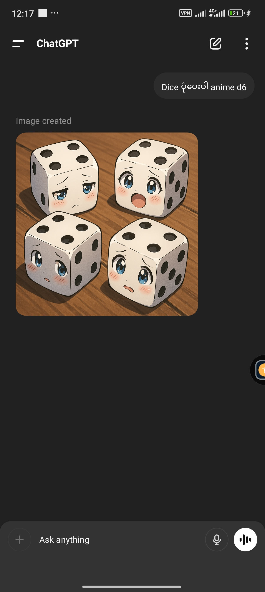

# For-Job
# AI Prompt Project - For ChatGPT, Midjourney, and More

Welcome to my AI prompt collection! I specialize in crafting powerful and creative prompts for various AI platforms such as ChatGPT, Midjourney, SeaArt, and more.

## About Me
I’m passionate about AI tools and language generation. I use my skills to help users create stories, art, and interactive experiences using prompts.

## Services Offered
- ChatGPT Prompt Writing (Storytelling, Dialogue, Q&A, Copywriting)
- Midjourney / SeaArt Prompt Design (Art-focused, Character Design, Backgrounds)
- AI-Powered Script and Narrative Writing
- Interactive Game Dialogues

## Output Samples
**Prompt:** Write a fantasy story about a warrior who must fight a shadow creature to save his beloved.  
**Output:** A gripping, emotionally driven narrative powered by ChatGPT...

**Prompt:** Generate an anime-style schoolgirl in a rainy street, lightning behind her.  
**Output:** Visual prompt used in SeaArt and Midjourney...

## Photo Samples
 
  
*ChatGBT Result - conversation with chatGBT*

  
GBT - Dice D6, Anime

  
*Deepai.Create an image depicting a Burmese woman, dressed in the traditional attire of the 1940s in Burma (Myanmar). The woman should be in the process of exiting a car. Her clothing should reflect the fashion of that era for Burmese women, which typically included a blouse (yinzi) and a longyi. The scene should evoke the atmosphere of 1947. The car should be visible and consistent with vehicles from that time period*

## Contact
GitHub: [https://github.com/zozozofia/For-Job](https://github.com/zozozofia/For-Job)  
Fiverr: [https://www.fiverr.com/waiyantoemyint]  
Email: [waiyantoemyint1@gmail.com]
